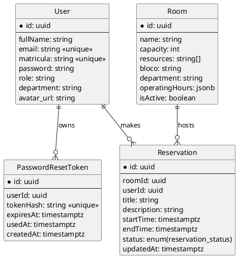

# Documento de Design de Banco de Dados
Sistema de Gestão de Reservas de Salas
Data: 10/11/2025  
Versão: 1.0  
Status: Em elaboração

## 1. Visão Geral
O banco de dados suporta autenticação, gerenciamento de salas, fluxo de reservas e processos auxiliares (reset de senha). Implementado em PostgreSQL via Prisma ORM.

Objetivos principais:
- Integridade e consistência de horários e conflitos.
- Consultas eficientes para agenda diária e relatórios.
- Flexibilidade para expansão (auditoria, logs de email, notificação, analytics).

## 2. Modelo Conceitual (Entidades e Relações)
Entidades atuais:

Futuras entidades (planejadas):

### 2.1 Diagrama ER (Mermaid)
```mermaid
erDiagram
  User ||--o{ Reservation : makes
  Room ||--o{ Reservation : hosts
  User ||--o{ PasswordResetToken : owns

  User {
    uuid id PK
    string fullName
    string email UNIQUE
    string matricula UNIQUE
    string password
    string role
    string department
    string avatar_url
  }
  Room {
    uuid id PK
    string name
    int capacity
    string[] resources
    string bloco
    string department
    jsonb operatingHours
    boolean isActive
  }
  Reservation {
    uuid id PK
    uuid roomId FK
    uuid userId FK
    string title
    string description
    timestamptz startTime
    timestamptz endTime
    enum status
    timestamptz updatedAt
  }
  PasswordResetToken {
    uuid id PK
    uuid userId FK
    string tokenHash UNIQUE
    timestamptz expiresAt
    timestamptz usedAt
    timestamptz createdAt
  }
```

### 2.2 Diagrama ER (PlantUML)


## 3. Modelo Lógico / Prisma
Trecho do `schema.prisma` (resumido):
  password  String
  role      String @default("user")
  passwordResetTokens PasswordResetToken[]
}
  id           String @id @default(uuid())
  name         String
  capacity     Int
CREATE INDEX IF NOT EXISTS reservation_room_start_idx ON "Reservation"("roomId", "startTime");
CREATE INDEX IF NOT EXISTS reservation_user_start_idx ON "Reservation"("userId", "startTime");
CREATE INDEX IF NOT EXISTS reservation_status_idx ON "Reservation"("status");
  operatingHours Json?
  isActive     Boolean @default(true)
  reservations Reservation[]
}

model Reservation {
  id        String @id @default(uuid())
  roomId    String
  userId    String
  title     String
  description String?
  startTime DateTime
  endTime   DateTime
  status    String @default("pending")
  updatedAt DateTime @updatedAt
  room      Room @relation(fields: [roomId], references: [id])
  user      User @relation(fields: [userId], references: [id])
}

model PasswordResetToken {
  id        String @id @default(uuid())
  userId    String
  tokenHash String @unique
  expiresAt DateTime
  usedAt    DateTime?
  createdAt DateTime @default(now())
  user User @relation(fields: [userId], references: [id])
}
```

## 4. Modelo Físico (PostgreSQL)
Tipos:
- UUID armazenado como `uuid` (Prisma converte String UUID). Atualmente String -> ideal migrar para `@db.Uuid` para otimizar.
- DateTime -> `timestamptz` (recomendado para preservar fuso; validar se Prisma gerou correção).
- String[] -> `text[]` para `resources`.
- Json -> `jsonb` (operatingHours).

Sugestão de ajuste futuro no Prisma:
```prisma
id String @id @default(uuid()) @db.Uuid
startTime DateTime @db.Timestamptz
endTime DateTime @db.Timestamptz
```

## 5. Normalização
- User, Room, Reservation estão em 3FN (sem atributos multivalorados exceto resources). `resources` como array atende uso atual; se for necessário busca avançada, considerar tabela pivot RoomResource.
- PasswordResetToken separa controle de segurança (evita expandir User com campos temporários). 3FN mantida.

Desnormalizações planeáveis:
- Materialização de view para estatísticas (reservas aprovadas por mês) para relatórios de alta frequência (uso de `CREATE MATERIALIZED VIEW` + refresh agendado).

## 6. Regras de Integridade e Constraints
Regras implementadas ou planejadas:
- Chaves primárias (UUID) em todas as entidades.
- UNIQUE: User.email, User.matricula, PasswordResetToken.tokenHash.
- FOREIGN KEY: Reservation(roomId)->Room(id), Reservation(userId)->User(id), PasswordResetToken(userId)->User(id).
- CHECK (futuro): status IN ('pending','approved','rejected','cancelled'). (Atualmente livre, possível erro de consistência.)
- CHECK (futuro): endTime > startTime.
- CHECK (futuro): capacity > 0.

DDL sugerido para checks:
```sql
ALTER TABLE "Reservation"
  ADD CONSTRAINT reservation_status_chk CHECK (status IN ('pending','approved','rejected','cancelled')),
  ADD CONSTRAINT reservation_interval_chk CHECK (end_time > start_time);

ALTER TABLE "Room"
  ADD CONSTRAINT room_capacity_chk CHECK (capacity > 0);
```

## 7. Índices e Performance
Índices necessários:
- `CREATE UNIQUE INDEX user_email_uq ON "User"(email);` (já implícito via Prisma)
- `CREATE UNIQUE INDEX user_matricula_uq ON "User"(matricula);`
- `CREATE INDEX reservation_room_start_idx ON "Reservation"(room_id, start_time);`
- `CREATE INDEX reservation_user_start_idx ON "Reservation"(user_id, start_time);`
- `CREATE INDEX reservation_status_idx ON "Reservation"(status);`
- Para relatórios mensais: `CREATE INDEX reservation_start_month_idx ON "Reservation"(date_trunc('month', start_time));` (alternativo: índice funcional)

Justificativa:
- Filtro por sala e intervalo de tempo (agenda diária) acelera busca de conflitos.
- Filtro por usuário e futuro (dashboard) usa índice composto user_id + start_time.
- Status indexado facilita contagens rápidas (pending vs approved).

## 8. Gerenciamento de Conflitos de Reserva
Lógica de conflito (aplicada na API) deve considerar interseção:
```
Novo intervalo [S,E) conflita se existir reserva R com status IN (pending, approved) e:
R.startTime < E AND R.endTime > S
```
O índice `reservation_room_start_idx` permite procurar rapidamente por reservas de uma sala cujo startTime < E, então filtrar endTime > S.

Query exemplo otimizada:
```sql
SELECT 1
FROM "Reservation"
WHERE room_id = $1
  AND status IN ('pending','approved')
  AND start_time < $2
  AND end_time > $3
LIMIT 1;
```

## 9. Estratégia de Migrações
- Ferramenta: Prisma Migrate.
- Naming: `YYYYMMDDHHmmss_description`.
- Política: migrations versionadas não devem ser editadas após merge; alterações retroativas exigem nova migração.
- Verificação CI: executar `prisma migrate deploy` seguido de smoke tests.

Rollback:
- Em dev: `prisma migrate reset`.
- Em produção: preferir migrações reversíveis (CREATE antes de DROP). Para mudanças destrutivas em dados, criar backup lógico (pg_dump) antes.

## 10. Segurança e Proteção de Dados
- Criptografia de senha: hash forte (bcrypt/argon2) – não armazenar plaintext.
- Token de reset: armazenar hash (`tokenHash`), nunca o token raw.
- Privilégios DB: usar usuário dedicado com apenas acesso CRUD às tabelas do schema.
- Auditoria futura: tabela AuditLog com minimally { id, userId?, action, entity, entityId?, meta(Json), createdAt }.
- Proteção contra enum livre de status: aplicar CHECK e migrar para enum PostgreSQL:
```sql
CREATE TYPE reservation_status AS ENUM ('pending','approved','rejected','cancelled');
ALTER TABLE "Reservation" ALTER COLUMN status TYPE reservation_status USING status::reservation_status;
```

## 11. Backup e Retenção
- Backup diário incremental + semanal full (pg_dump / base backups).
- Retenção sugerida: 12 meses para PasswordResetToken (limpar expirados >30 dias). Reservas mantidas indefinidamente (ou política futura de arquivamento).
- Job de limpeza:
```sql
DELETE FROM "PasswordResetToken" WHERE expires_at < now() - interval '30 days';
```

## 12. Escalabilidade e Crescimento
- Premissas: Crescimento linear de reservas (~N usuários * M reservas/mês).
- Sharding não requerido no curto prazo.
- Otimizações futuras: Particionamento por mês da tabela Reservation se volume ultrapassar milhões.
```sql
CREATE TABLE "Reservation_2025_11" PARTITION OF "Reservation" FOR VALUES FROM ('2025-11-01') TO ('2025-12-01');
```

## 13. Observabilidade
- Log de queries lentas: ajustar `log_min_duration_statement`.
- Monitorar índices não utilizados (pg_stat_user_indexes) e ajustar.

## 14. Exemplos de Consultas
Agenda diária por sala:
```sql
SELECT id, title, start_time, end_time, status
FROM "Reservation"
WHERE room_id = $1
  AND start_time >= $2::timestamptz
  AND end_time   <  ($2::timestamptz + interval '1 day')
  AND status IN ('pending','approved')
ORDER BY start_time;
```
Próximas 3 reservas de um usuário:
```sql
SELECT id, room_id, start_time, end_time, status
FROM "Reservation"
WHERE user_id = $1
  AND start_time > now()
  AND status IN ('pending','approved')
ORDER BY start_time
LIMIT 3;
```
Relatório de uso mensal:
```sql
SELECT date_trunc('month', start_time) AS mes,
       count(*) FILTER (WHERE status='approved') AS aprovadas,
       count(*) FILTER (WHERE status='rejected') AS rejeitadas,
       count(*) FILTER (WHERE status='pending')  AS pendentes
FROM "Reservation"
GROUP BY 1
ORDER BY 1 DESC;
```

## 15. Naming Conventions
- Tabelas: Pascal singular no Prisma; físico: "User", "Room", "Reservation" (manter capitalização) – pode migrar para snake minúsculo (`users`, `rooms`, `reservations`) se padronização futura exigir.
- Colunas: camelCase no Prisma -> físico em snake_case (Prisma converte internamente). Consistência: preferir `start_time`, `end_time` no nível SQL.
- Índices: <tabela>_<coluna>[_...]_idx / <tabela>_<coluna>_uq.

## 16. Planos de Evolução
Próximos incrementos:
1. Migrar status para enum PostgreSQL.
2. Adicionar tabela AuditLog.
3. Introduzir RoomResource pivot se busca granular crescer.
4. Materialized View para métricas e refresh agendado.
5. Particionamento se volume > 10M linhas Reservation.

## 17. Riscos e Mitigações
| Risco | Impacto | Mitigação |
|-------|---------|-----------|
| Falta de CHECK em status | Valores inválidos | Migrar para enum + constraint |
| Crescimento sem índice composto | Lentidão agenda | Criar índice room_id+start_time cedo |
| Array resources pouco pesquisável | Dificulta filtros | Pivot RoomResource + índices |
| Tokens reset sem limpeza | Cresce espaço | Job agendado de purge |
| Falta de timezone consistente | Divergência horários | Usar timestamptz + offset fixo na aplicação |

## 18. Checklist de Qualidade
- [ ] Constraints de intervalo aplicadas
- [ ] Índices criados conforme seção 7
- [ ] Enum status migrado
- [ ] Job limpeza tokens implementado
- [ ] Script backup automatizado

## 19. Apêndice: Script Inicial de Índices
```sql
CREATE INDEX IF NOT EXISTS reservation_room_start_idx ON "Reservation"(room_id, start_time);
CREATE INDEX IF NOT EXISTS reservation_user_start_idx ON "Reservation"(user_id, start_time);
CREATE INDEX IF NOT EXISTS reservation_status_idx ON "Reservation"(status);
```

---
Manter este documento versionado (v1.1, v1.2...) conforme alterações estruturais.
